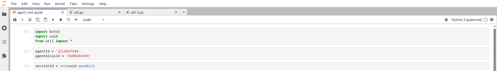

# cip_genai_may_2025
Repository including hands-on sessions for my latest talk to CIP (Colegio de Ingenieros del Peru) on May 3, 2025.


## Chapters

1.  [RAG Example](#1-rag-example)
2.  [AI Agent](#2-ai-agent)

---

## 1 - RAG Example

### Creating and Testing a Bedrock Knowledge Base via AWS Console

This guide walks through creating an S3 bucket, uploading data, setting up an Amazon Bedrock Knowledge Base using that data, and testing its Retrieval-Augmented Generation (RAG) capabilities.

**Prerequisites:**

* An AWS Account with permissions for S3, Bedrock, and IAM.
* The `pokemonhunters.csv` file available on your local machine.

#### Step 1: Create S3 Bucket and Upload Data

1.  **Navigate to S3:** Log in to the AWS Management Console and go to the S3 service.
2.  **Create Bucket:**
    * Click **Create bucket**.
    * Enter a unique **Bucket name**: `pokemonhunters`
    * Select the **AWS Region**: `us-east-1` (or your preferred region where Bedrock Knowledge Bases are available).
    * Leave other settings as default (unless specific configuration is needed).
    * Click **Create bucket**.
3.  **Upload File:**
    * Navigate into the newly created `pokemonhunters` bucket.
    * Click **Upload**.
    * Click **Add files**.
    * Select the `pokemonhunters.csv` file from your computer.
    * Click **Upload**. Wait for the upload to complete successfully.


#### Step 2: Create Bedrock Knowledge Base

1.  **Navigate to Bedrock:** Go to the Amazon Bedrock service in the AWS Console.
2.  **Go to Knowledge Bases:** In the left navigation pane, under "Builder tools", click **Knowledge bases**.
3.  **Create Knowledge Base:** Click **Create knowledge base**.
4.  **Provide Knowledge Base Details:**
    * **Name:** Enter a name, e.g., `PokemonHuntersKB-Console`.
    * **(Optional) Description:** Add a description.
    * **IAM permissions:**
        * Choose **Create and use a new service role**. AWS will create a role with the necessary permissions.
        * Enter a **Service role name**, e.g., `AmazonBedrockExecutionRoleForKBPokemon`.
        * Alternatively, if you have a pre-existing compatible role, select **Choose an existing service role**.
    * Click **Next**.
5.  **Set Up Data Source:**
    * **Name:** Enter a Data source name, e.g., `PokemonHuntersS3DataSource-Console`.
    * **S3 URI:** Click **Browse S3**. Navigate to and select your `pokemonhunters` bucket. The URI should look like `s3://pokemonhunters/`. Bedrock will scan this location.
    * *(Note: Bedrock will automatically detect the `.csv` file within the specified bucket/prefix during the sync process).*
    * Click **Next**.
6.  **Configure Vector Store and Embedding Model:**
    * **Embedding model:** Click **Browse**. Search for and select `Titan Embeddings G1 - Text`.
    * **Vector store:** Select **Quick create a new vector store**. This uses the Bedrock managed vector database, which is the simplest option.
    * Click **Next**.
7.  **Review and Create:**
    * Review the configuration details.
    * Click **Create knowledge base**. Creation might take a minute.
8.  **Sync Data Source:**
    * Once the Knowledge Base status is "Active", navigate to its details page.
    * Select the **Data source** you created (e.g., `PokemonHuntersS3DataSource-Console`).
    * Click the **Sync** button.
    * Wait for the **Last sync status** to change from "In progress" to **Completed**. This sync process ingests your `pokemonhunters.csv` data into the vector store. This can take a few minutes. You might need to refresh the page.


#### Step 3: Test the Knowledge Base (RAG)

1.  **Navigate to Test Interface:** Once the data source sync is **Completed**, go back to your Knowledge Base (`PokemonHuntersKB-Console`) page in Bedrock. Look for a "Test" section or button, or navigate to **Playgrounds -> Chat** in the left menu and select your Knowledge Base. The interface should resemble the reference image provided, often labeled "Chat with your document" or similar when a KB is selected.
2.  **Select Knowledge Base:** Ensure your newly created Knowledge Base (`PokemonHuntersKB-Console`) is selected as the data source for the chat session.
3.  **Select Model:**
    * Find the model selection dropdown (top-left in the chat pane).
    * Click **Select model**.
    * Choose **Anthropic** as the provider.
    * Select **Claude 3 Haiku** as the model.
4.  **Enter Query:**
    * In the chat input box at the bottom right, type a question whose answer should be present **specifically within your `pokemonhunters.csv` file**.
        * `What is pokemonhunters and what is its business?`
5.  **Run Query:** Click the **Run** button (the orange button with a right-arrow icon).
6.  **Verify RAG Capabilities:**
    * **Check the Answer:** Observe the generated response from Claude 3 Haiku. It should accurately answer your question based on the information retrieved from the `pokemonhunters.csv` document.
    * **Look for Citations/Sources:** The test interface usually provides references to the specific chunks of data from your S3 document that were retrieved and used to generate the answer. This confirms that the Retrieval-Augmented Generation (RAG) process is working – the model isn't just using its general knowledge but is grounding its response in your provided data.


---
## 2 - AI Agent

This section details how to create an Amazon Bedrock Agent capable of handling T-shirt returns for an online store, using a Lambda function for the return processing logic.

**Prerequisites:**

* An AWS Account with permissions for IAM, Lambda, and Bedrock.
* The AWS CLI or Boto3 (for Python/Jupyter) installed and configured if you plan to test programmatically.
* A file named `lambda.py` located in the `ai_agent` folder of your project structure, containing the Python code for the Lambda function (example provided below).
* Access to a Jupyter Notebook environment for running the test scenarios.

### Step 1: Create IAM Role for Agent

This role grants the Bedrock Agent permissions to invoke other AWS services, specifically Bedrock models and the Lambda function we will create.

1.  **Navigate to IAM:** Log in to the AWS Management Console and go to the IAM service.
2.  **Create Role:**
    * Click **Roles** in the left navigation pane, then **Create role**.
    * **Trusted entity type:** Select **AWS service**.
    * **Use case:** Choose **Bedrock** from the dropdown, then select the **Allows Bedrock Agents...** use case below it. This automatically sets the trust relationship for `bedrock.amazonaws.com`. Click **Next**.
    * **Add permissions:**
        * Search for and select the policy `AmazonBedrockFullAccess`.
        * Search for and select the policy `AWSLambda_FullAccess`.
        * *(Note: For production, it's best practice to create more restricted policies granting only necessary permissions, e.g., `lambda:InvokeFunction` on the specific Lambda ARN and access to only the required Bedrock models.)*
    * Click **Next**.
    * **Role name:** Enter `cip_bedrock_agent`.
    * **(Optional) Description:** Add a description like "Role for Bedrock Agent handling T-Shirt returns".
    * Review the settings and click **Create role**.
3.  **Note the Role ARN:** Once created, find the role and copy its ARN (e.g., `arn:aws:iam::YOUR_ACCOUNT_ID:role/cip_bedrock_agent`). You'll need it later.


### Step 2: Create Bedrock Agent

1.  **Navigate to Bedrock Agents:** In the Bedrock service console, go to **Agents** under "Builder tools".
2.  **Create Agent:** Click **Create Agent**.
3.  **Provide Agent details:**
    * **Name:** `customer-support-agent`
    * **(Optional) Description:** "Agent for handling T-Shirt store orders and returns."
    * **Select model:**
        * **Category:** Anthropic
        * **Model:** Claude 3 Haiku
        * **(Optional) Provide model instructions:** *(Leave blank for now, use main instructions below)*
    * **Instructions for the Agent:** Paste the detailed instructions:
        ```text
        You are an agent that works at a T-Shirt store. You are able to place orders and handle returns. Items are only able to be returned if it was purchased within 30 days. Red color T-Shirts cannot be returned. All other colors can be returned. You will also need to ask for the order number in order to return items for customers. After you confirm the item was purchased within 30 days, the color is not red and you have the order number, call the action group to process the return online and then inform the customer the return has processed and they can just send back the T-Shirt.
        ```


* **IAM permissions:** Select **Choose an existing service role** and select the `cip_bedrock_agent` role you created earlier.
    * **(Optional) User input:** Can set to OFF if not needed for your flow. Default is ON.
    * **(Optional) Idle session timeout:** Keep default (e.g., 30 minutes).
4.  **Add Action Group:**
    * Click **Next** or scroll down to **Action groups**.
    * Click **Add**.
    * **Action group name:** `return_item_actions`
    * **(Optional) Description:** "Actions for handling item returns."
    * **New Lambda function:** Create a new AWS lambda function *(Note: You'll need to provide an API schema and modify the Lambda code later)*
    * Click **Add**.
5.  **Configure Advanced Prompts & Knowledge Base:**
    * For this setup, skip **Knowledge base** configuration.
    * You can review **Advanced prompts** but leave them as default for now.
    * Click **Next**.
6.  **Review and Create:** Review all agent settings and click **Create Agent**.


### Step 3: Prepare Agent (Version & Alias)

The agent needs to be prepared (versioned) and aliased before it can be invoked.

1.  **Prepare Agent:** Once the agent is created (status should be `NOT_PREPARED`), click the **Prepare** button on the agent's overview page. This creates Version 1. Wait for the preparation to complete (status becomes `PREPARED` or shows the version number).
2.  **Create Alias:**
    * In the left navigation for your agent, click **Aliases**.
    * Click **Create alias**.
    * **Alias name:** Enter `live` (or another meaningful name).
    * **Select version:** Choose **Version 1** from the dropdown.
    * Click **Create alias**.
3.  **Note IDs:** Find and note down the **Agent ID** and the **Agent Alias ID** (`live` alias). You'll need these for testing.


### Step 4: Modify AWS Lambda Function

In the **Code source** section [of the Lambda function created or selected in Step 2.4], open the `lambda_function.py` (or similarly named default file).
    * **Replace the entire content** of this file with the code from **your** `ai_agent/lambda.py` file.


### Step 5: Test the Agent (Jupyter Notebook)

1.  Note: The `util` package refers to the helper functions defined in the file named `util.py` located within the `ai_agent` folder.




2.  Run the following code cell to load the necessary libraries:
    ```python
    import boto3
    import uuid
    from util import * # Assumes util.py is in the python path or same directory
    ```

3.  Run this cell to map your specific Agent ID and Alias ID values:
    ```python
    agentId = '2CLEWSTS44'      # Replace with your actual Agent ID if different
    agentAliasId = 'OUOKEAXHYH' # Replace with your actual Agent Alias ID if different
    sessionId = str(uuid.uuid4()) # Generate a unique session ID for the conversation
    ```

4.  Run this cell to define the question you want to ask the agent and then invoke the agent:
    ```python
    # Replace '[Question]' with the actual text input for the agent
    message = '[Question]'

    # This calls the invoke_agent function (expected to be defined in util.py)
    response = invoke_agent(
        agentId=agentId,
        agentAliasId=agentAliasId,
        sessionId=sessionId,
        inputText=message,
        endSession=False, # Set to True if this is the last turn for this session
        enableTrace=True  # Set to False to disable detailed trace output
    )

    # You would typically add code here to print or process the response
    # print(response)
    ```

**Run Cells:** Execute the cells sequentially. Replace placeholders for `AGENT_ID` and `AGENT_ALIAS_ID` first. Observe the agent's responses printed in the output of cells 2 and 3. Check if the behavior matches the expected outcomes based on the agent's instructions and the simulated Lambda logic. Also check CloudWatch Logs for the Lambda function to see invocation details, especially for the second scenario.


 and showing successful return confirmation")